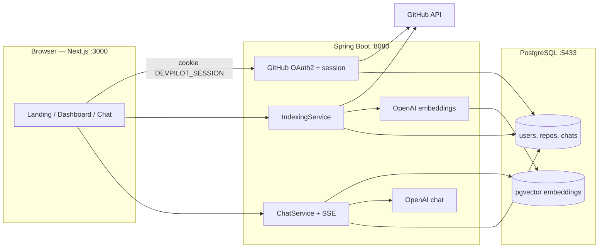

# DevPilot

**Connect GitHub, index a repository, and chat with your codebase** — with answers grounded in retrieved code and clickable source citations.

DevPilot is a full-stack Retrieval-Augmented Generation (RAG) workspace. Sign in with GitHub, sync the repositories you can access, embed source files into PostgreSQL with [pgvector](https://github.com/pgvector/pgvector), then ask questions in a streaming chat UI. The model is instructed to answer only from retrieved context, so replies stay tied to *your* code rather than generic training data.

Repository: [github.com/hanuvadlamudi/dev-ai-rag-tools](https://github.com/hanuvadlamudi/dev-ai-rag-tools)

---

## Table of contents

- [Why it exists](#why-it-exists)
- [What you can do](#what-you-can-do)
- [How it works](#how-it-works)
- [Architecture](#architecture)
- [Repository layout](#repository-layout)
- [Tech stack](#tech-stack)
- [Prerequisites](#prerequisites)
- [Quick start](#quick-start)
- [GitHub OAuth app](#github-oauth-app)
- [Environment variables](#environment-variables)
- [Local URLs and ports](#local-urls-and-ports)
- [User journey](#user-journey)
- [HTTP API](#http-api)
- [Data model](#data-model)
- [Indexing and RAG details](#indexing-and-rag-details)
- [Security notes](#security-notes)
- [Development](#development)
- [Deploy on Vercel](#deploy-on-vercel)
- [Known limitations](#known-limitations)
- [License](#license)

---

## Why it exists

Reading an unfamiliar repository usually means jumping between files, READMEs, and git history. DevPilot turns that into a conversation:

1. **You** pick a repo you already have access to on GitHub.
2. **DevPilot** walks the default branch, chunks eligible source files, and stores embeddings next to your app data.
3. **You** ask questions in chat. The backend retrieves the most similar chunks, builds a grounded prompt, and streams the answer with citations back to the browser.

The product name in the UI is **DevPilot**. The git repository is named `dev-ai-rag-tools`.

---

## What you can do

| Capability | What happens |
|---|---|
| Sign in with GitHub | OAuth2 with `read:user` and `repo` so public *and* private repos you can access are available |
| Sync repositories | Paginated GitHub `/user/repos` sync into Postgres (up to 1,000 repos per user) |
| Index a repository | Async pipeline: git tree → filter files → chunk → embed → pgvector |
| Watch progress | Dashboard and chat poll index status (`PENDING` → `INDEXING` → `COMPLETED` / `FAILED`) |
| Chat with citations | SSE token stream plus file-path citations that open on GitHub |
| Multiple chat sessions | Several conversations per repository, listed in the chat sidebar |
| Dark / light theme | Client theme toggle (Next Themes + shadcn) |

---

## How it works



**Indexing (simplified):**

1. Delete any existing vectors for that `repoId`.
2. Fetch the recursive git tree for the repository’s **default branch**.
3. Skip junk directories (`node_modules`, `target`, `.git`, …), lockfiles, and files larger than 100 KB.
4. Split remaining files with Spring AI `TokenTextSplitter` (configured chunk size 800 characters).
5. Embed with `text-embedding-3-small` (1536 dimensions) and store with HNSW + cosine distance.

**Chat (simplified):**

1. Persist the user message.
2. Similarity-search the top 8 chunks for that repo.
3. Build a system prompt (“answer only from the provided code context”) plus a user prompt (context + question).
4. Stream tokens over SSE (`token` events), then persist the assistant message and citations.

Prior turns in the thread are **not** sent to the model — only the current question and retrieved chunks.

---

## Architecture

| Layer | Role |
|---|---|
| **client** | Next.js App Router UI. Talks **directly** to the Spring API (`credentials: "include"`). No Next.js API routes or rewrites. |
| **backend** | Spring Boot 4 REST API, OAuth2 login, JPA entities, async indexing, Spring AI chat + vector store. |
| **postgres** | Single Docker service: relational tables *and* the pgvector store. Host port **5433** so it does not collide with a local Postgres on 5432. |

Session auth uses an HttpOnly cookie named `DEVPILOT_SESSION` (SameSite=Lax, 7-day timeout). The frontend also sets a non-authoritative `devpilot_auth=1` cookie as a client-side hint after `/api/auth/me` succeeds.

---

## Repository layout

```
dev-ai-rag-tools/
├── docker-compose.yml              # pgvector/pg16 — db `devpilot` on host 5433
├── docker/postgres/
│   └── init-extensions.sql         # vector, hstore, uuid-ossp (first volume init only)
├── backend/                        # Maven / Java 21 / Spring Boot 4.1.1
│   ├── pom.xml
│   ├── mvnw
│   └── src/main/java/devPilot/backend/
│       ├── BackendApplication.java
│       ├── config/                 # CORS, crypto, security, async executor
│       ├── controllers/            # Auth, repos, chat
│       ├── dto/
│       ├── entity/
│       ├── exceptions/
│       ├── repository/
│       ├── security/               # OAuth2 user service, CurrentUser
│       └── services/
│           ├── ai/                 # retrieve, prompt, stream
│           ├── github/             # GitHub REST client + rate limiter
│           └── indexing/           # filter, chunk, async index
└── client/                         # Next.js 16 / React 19 / Tailwind 4
    ├── app/                        # /, /login, /auth/callback, /dashboard, /chat/[repoId]
    ├── components/
    ├── hooks/
    └── lib/api.ts                  # API base + fetch helpers
```

---

## Tech stack

### Backend

| Piece | Version / notes |
|---|---|
| Java | 21 |
| Spring Boot | 4.1.1 |
| Spring AI | 2.0.1 (`spring-ai-starter-model-openai`, `spring-ai-starter-vector-store-pgvector`) |
| Spring Security | Session + OAuth2 client (GitHub) |
| Spring Data JPA / Hibernate | `ddl-auto=update` |
| PostgreSQL driver | Runtime |
| Build | Maven Wrapper (`./mvnw`) |

### Frontend

| Piece | Version / notes |
|---|---|
| Next.js | 16.3.2 (App Router) |
| React | 19.2.8 |
| Tailwind CSS | 4 |
| UI | shadcn (`base-nova`, zinc) |
| Data fetching | TanStack Query 5 |
| Streaming markdown | Streamdown + Shiki |
| Theming | next-themes |

### Infrastructure

| Piece | Notes |
|---|---|
| Docker Compose | `pgvector/pgvector:pg16`, container `devpilot-postgres` |
| OpenAI | Chat: `gpt-4o-mini` · Embeddings: `text-embedding-3-small` |

---

## Prerequisites

- **Docker Desktop** (or Docker Engine + Compose) for Postgres
- **JDK 21** on `PATH` / `JAVA_HOME` (the backend toolchain is Java 21)
- **Node.js 20+** and npm (for the client)
- An **OpenAI API key**
- A **GitHub OAuth App** (see [GitHub OAuth app](#github-oauth-app))

---

## Quick start

From the repository root:

```bash
# 1. Vector-capable Postgres
docker compose up -d

# Wait until healthy (pg_isready). First boot also creates extensions from
# docker/postgres/init-extensions.sql — only on an empty data volume.

# 2. Backend (default http://localhost:8080)
cd backend
export OPENAI_API_KEY=sk-...
export GITHUB_CLIENT_ID=your_oauth_client_id
export GITHUB_CLIENT_SECRET=your_oauth_client_secret
./mvnw spring-boot:run
```

In a second terminal:

```bash
# 3. Frontend (default http://localhost:3000)
cd client
npm install
npm run dev
```

Open [http://localhost:3000](http://localhost:3000) → **Continue with GitHub**.

If port 8080 is already in use, stop the other Java process (often a previous `BackendApplication`) rather than changing the app port:

```bash
lsof -nP -iTCP:8080 -sTCP:LISTEN
```

---

## GitHub OAuth app

Create an OAuth App under GitHub → **Settings → Developer settings → OAuth Apps**.

| Field | Local value |
|---|---|
| Homepage URL | `http://localhost:3000` |
| Authorization callback URL | `http://localhost:8080/login/oauth2/code/github` |

Spring Security starts the flow at:

```
GET http://localhost:8080/oauth2/authorization/github
```

After a successful login the backend redirects to `{FRONTEND_URL}/auth/callback` (default `http://localhost:3000/auth/callback`). Failures redirect to `{FRONTEND_URL}/login?error=oauth_failed`.

Set `GITHUB_CLIENT_ID` and `GITHUB_CLIENT_SECRET` in the environment. Do not commit production secrets.

---

## Environment variables

### Backend

Values in `backend/src/main/resources/application.properties` can be overridden with env vars.

| Variable | Default (local) | Purpose |
|---|---|---|
| `OPENAI_API_KEY` | *(required — no default)* | Chat and embeddings |
| `OPENAI_CHAT_MODEL` | `gpt-4o-mini` | Chat completions |
| `OPENAI_EMBEDDING_MODEL` | `text-embedding-3-small` | Must stay 1536-d to match pgvector config |
| `GITHUB_CLIENT_ID` | *(set your app)* | GitHub OAuth client id |
| `GITHUB_CLIENT_SECRET` | *(set your app)* | GitHub OAuth client secret |
| `DB_URL` | `jdbc:postgresql://localhost:5433/devpilot` | JDBC URL |
| `DB_USERNAME` | `postgres` | Database user |
| `DB_PASSWORD` | `postgres` | Database password |
| `FRONTEND_URL` | `http://localhost:3000` | Post-login / post-failure redirects |
| `CORS_ALLOWED_ORIGINS` | `http://localhost:3000` | Comma-separated allowed origins (credentials enabled) |
| `TOKEN_ENCRYPTOR_PASSWORD` | local-only default | AES password for stored GitHub tokens |
| `TOKEN_ENCRYPTOR_SALT` | local-only default | Hex salt for the encryptor — **keep stable** or existing tokens cannot be decrypted |

Indexing tunables (properties, not env):

| Property | Default | Meaning |
|---|---|---|
| `app.indexing.max-file-bytes` | `102400` | Skip larger blobs (100 KB) |
| `app.indexing.chunk-size` | `800` | Character budget fed into the token splitter |
| `app.github.api-delay-ms` | `50` | Pause between GitHub file fetches |

`app.indexing.chunk-overlap` is present in config (`100`) but is **not used** by the current chunker.

Leave `spring.ai.openai` base URL unset so the official client uses `https://api.openai.com/v1`.

### Frontend

| Variable | Default | Purpose |
|---|---|---|
| `NEXT_PUBLIC_API_BASE_URL` | `http://localhost:8080` | Spring Boot origin |

There is no committed `.env.example` yet. For local work, defaults are enough if the backend is on 8080.

---

## Local URLs and ports

| Service | URL |
|---|---|
| Marketing / app | http://localhost:3000 |
| Login | http://localhost:3000/login |
| OAuth return | http://localhost:3000/auth/callback |
| Dashboard | http://localhost:3000/dashboard |
| Chat | http://localhost:3000/chat/`{repositoryUuid}` |
| API | http://localhost:8080 |
| Postgres (host) | `localhost:5433` → container `5432` |

---

## User journey

1. **Landing** (`/`) — product pitch and **Continue with GitHub**.
2. **Login** (`/login`) — same OAuth entry; supports `?error=` and `?next=`.
3. **Callback** (`/auth/callback`) — calls `GET /api/auth/me`. Success → `/dashboard`. Failure → `/login?error=session`.
4. **Dashboard** (`/dashboard`) — repository cards, search, visibility/status filters, **Sync**, **Index**.
5. **Chat** (`/chat/[repoId]`) — if the repo is still `PENDING`, indexing starts automatically. Chat unlocks only when status is `COMPLETED`. Sessions live in the sidebar; messages stream in.

Route protection on the client is `<RequireAuth>` (redirects to `/login`). The real session is the backend cookie.

---

## HTTP API

Base URL: `http://localhost:8080`

Unless noted, endpoints require an authenticated session (`DEVPILOT_SESSION`). Call them with `credentials: "include"` from the browser.

Errors from `GlobalExceptionHandler` look like:

```json
{
  "status": 404,
  "error": "Not Found",
  "message": "…",
  "timestamp": "…"
}
```

### Auth

| Method | Path | Auth | Description |
|---|---|---|---|
| `GET` | `/api/auth/login-url` | Public | `{ "url": "/oauth2/authorization/github" }` |
| `GET` | `/api/auth/me` | Session | Current user profile |
| `POST` | `/api/auth/logout` | Session | `204`, clears session cookie |
| `GET` | `/oauth2/authorization/github` | Public | Start GitHub OAuth |
| `GET` | `/login/oauth2/**` | Public | OAuth callback (Spring Security) |

**`UserResponse`:** `id`, `githubId`, `githubUsername`, `displayName`, `avatarUrl`

### Repositories

| Method | Path | Auth | Description |
|---|---|---|---|
| `GET` | `/api/repos?refresh=true\|false` | Session | List (and optionally re-sync from GitHub) |
| `GET` | `/api/repos/{id}` | Session | One repository (must belong to you) |
| `POST` | `/api/repos/{id}/index` | Session | Start async index → `202` + repo payload |
| `GET` | `/api/repos/{id}/status` | Session | Index progress |

**`RepositoryResponse`:** `id`, `githubRepoId`, `owner`, `name`, `fullName`, `isPrivate`, `defaultBranch`, `language`, `htmlUrl`, `description`, `indexStatus`, `indexedAt`, `chunkCount`, `filesTotal`, `filesProcessed`, `errorMessage`

**`IndexStatusResponse`:** `repositoryId`, `indexStatus`, `filesTotal`, `filesProcessed`, `chunkCount`, `indexedAt`, `errorMessage`

`indexStatus`: `PENDING` | `INDEXING` | `COMPLETED` | `FAILED`

A second index is rejected while status is `INDEXING`.

### Chat

| Method | Path | Auth | Description |
|---|---|---|---|
| `POST` | `/api/chat/sessions` | Session | Body: `{ "repositoryId": "<uuid>", "title"?: "…" }` |
| `GET` | `/api/chat/sessions?repositoryId=` | Session | Sessions for a repo, newest first |
| `GET` | `/api/chat/sessions/{id}` | Session | Messages in a session |
| `POST` | `/api/chat/sessions/{id}/messages` | Session | Body `{ "content": "…" }` — **SSE** |

Chat is rejected unless the repository index status is `COMPLETED`.

**SSE events** (`text/event-stream`):

| Event | Payload |
|---|---|
| `user_message` | Saved user `ChatMessageResponse` |
| `token` | JSON-encoded token string |
| `assistant_message` | Final assistant message (includes citations) |
| `done` | `"[DONE]"` |

**`CitationDto`:** `filePath`, `startLine`, `endLine`, `language`

---

## Data model

Hibernate creates / updates these tables (`spring.jpa.hibernate.ddl-auto=update`).

| Table | Purpose |
|---|---|
| `users` | GitHub identity + **encrypted** access token |
| `repositories` | Per-user repo metadata and index progress; unique `(user_id, github_repo_id)` |
| `chat_sessions` | A conversation scoped to one user + one repo |
| `chat_messages` | `USER` / `ASSISTANT` rows; citations stored as JSON text |
| Spring AI vector table | Embeddings + metadata (`repoId`, `filePath`, `language`, `chunkIndex`) |

GitHub tokens are encrypted with Spring `Encryptors.text(password, salt)` before insert. Changing `TOKEN_ENCRYPTOR_PASSWORD` or `TOKEN_ENCRYPTOR_SALT` after users have logged in will make stored tokens unreadable until they sign in again (re-encrypt on login).

---

## Indexing and RAG details

**Eligible files** include common source and config extensions (Java, Kotlin, TypeScript/JavaScript, Python, Go, Rust, SQL, Markdown, YAML, HTML/CSS, Vue/Svelte, Docker/Make, shell, and others). Dotfiles and package lockfiles are skipped.

**Skipped directories:** `node_modules`, `.git`, `dist`, `build`, `target`, `.next`, `vendor`, `__pycache__`, `.idea`, `.vscode`, `coverage`, `out`.

**Concurrency:** indexing runs on a small async pool (2–4 threads, queue 50). Files are fetched sequentially per repo with a configurable GitHub API delay.

**Retrieval:** cosine similarity, `topK = 8`, filtered by `repoId`.

**Re-index:** existing vectors for that repo are deleted, then the tree is walked again.

**Init script caveat:** `docker/postgres/init-extensions.sql` runs only when the named volume is first created. Changing the SQL later requires `docker compose down -v` (this **wipes** local data).

---

## Security notes

- CSRF is **disabled**. Protection relies on SameSite=Lax cookies plus a tight CORS allow-list.
- Only `/api/auth/login-url`, OAuth endpoints, `/error`, and `OPTIONS /**` are public. Other `/api/**` routes return **401** if there is no session.
- Treat `TOKEN_ENCRYPTOR_*` and GitHub OAuth credentials as secrets in any shared or production environment.
- `ddl-auto=update` is convenient for local development, not a substitute for versioned migrations.

---

## Development

```bash
# Backend compile / tests / JAR
cd backend
./mvnw -DskipTests compile
./mvnw test
./mvnw package

# Frontend
cd client
npm run dev
npm run lint
npm run build
```

Useful backend packages when you extend the product:

| Package | Responsibility |
|---|---|
| `devPilot.backend.controllers` | HTTP surface |
| `devPilot.backend.services.indexing` | File filter, chunker, async index |
| `devPilot.backend.services.ai` | Retrieval, prompt, SSE |
| `devPilot.backend.services.github` | GitHub REST + pacing |
| `devPilot.backend.security` | Principal + OAuth user upsert |

---

## Deploy on Vercel

The **Next.js client** can be hosted on [Vercel](https://vercel.com/hanuvadlamudis-projects). The Spring Boot API, PostgreSQL, and pgvector **cannot** run on Vercel — they need a JVM + Postgres host (Railway, Render, Fly.io, or a VM). The Vercel site talks to that API via `NEXT_PUBLIC_API_BASE_URL`.

### Import the GitHub repo

1. Open [vercel.com/hanuvadlamudis-projects](https://vercel.com/hanuvadlamudis-projects) → **Add New** → **Project**.
2. Import `hanuvadlamudi/dev-ai-rag-tools`.
3. Set **Root Directory** to `client` (this is a monorepo).
4. Framework Preset: **Next.js**.
5. Add environment variable:
   - `NEXT_PUBLIC_API_BASE_URL` = your public backend URL (no trailing slash), e.g. `https://api.example.com`
6. Deploy.

`client/vercel.json` is already in the repo. After the first import, every push to the connected branch redeploys.

### After the frontend is live

Point the backend at the Vercel origin and GitHub OAuth at both URLs:

| Variable | Example |
|---|---|
| `FRONTEND_URL` | `https://your-app.vercel.app` |
| `CORS_ALLOWED_ORIGINS` | `http://localhost:3000,https://your-app.vercel.app` |
| GitHub OAuth callback | `https://<backend-host>/login/oauth2/code/github` |

Without a hosted backend, the Vercel UI will load but login/index/chat will fail (the browser cannot reach `localhost:8080`).

---

## Known limitations

These are current product constraints, not setup errors:

- Chat context is **stateless across turns** (current question + top-8 chunks only).
- Indexing uses the **default branch** only.
- Files over **100 KB** are skipped; per-file GitHub failures are logged and skipped (partial indexes are possible).
- GitHub sync is capped at **1,000** repositories.
- Citation line numbers may be empty — the chunker stores path/language/index, not always start/end lines.
- Sidebar links to `/dashboard/overview` and `/dashboard/settings` exist in the UI, but those App Router pages are not wired yet (the page components live under `client/components/dashboard/`).
- Automated coverage is currently the Spring `contextLoads` test plus frontend lint.

---

## License

No license file is in the repository yet. All rights reserved by the author unless a `LICENSE` is added.

---

Built as a learning-grade but complete RAG loop: **GitHub → chunks → pgvector → streaming chat with citations.**
